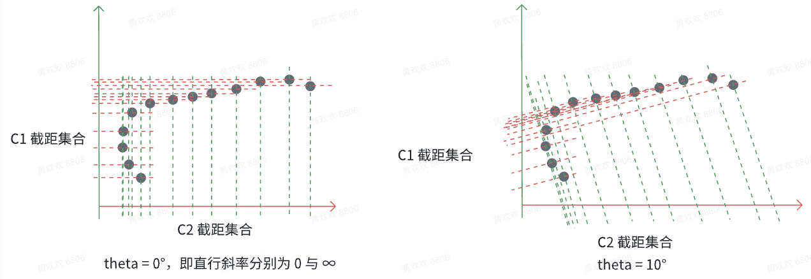
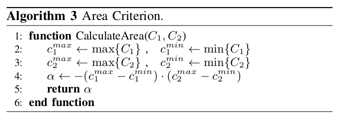
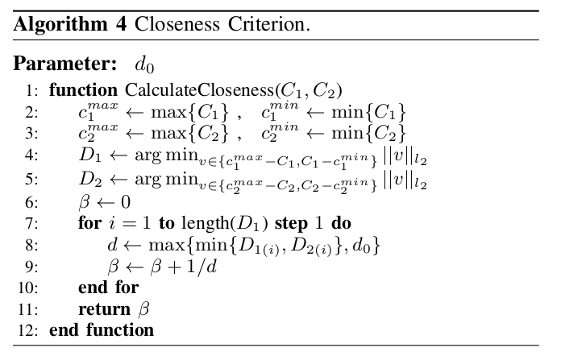
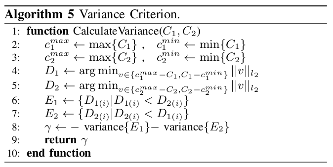

# 常见的包围框生成方法

## AABB（Axis-Aligned Bounding Box）

原理：计算所有点的最小 x, y、最大x, y，形成矩形，该矩形平行于坐标轴，不会旋转  

优点：计算简单，性能高  

缺点：对于非轴对齐的目标，会包含大量空白区域

## OBB（Oriented Bounding Box）

原理：采用最小面积原则拟合多边形

### 凸包法

### 主成分分析（PCA）

优点：适用于旋转目标

缺点：对于点云形态不完整的目标，比如机动车目标，只剩下 一条边和一条宽形成的 L 型，很多时候通过最小面积形成的框不是贴边的，如

## 最小外接圆（Minimum Enclosing Circle）

路端或车端的工作中一般生成的包围框不使用圆，主要用的矩形框，就不深入了解这部分内容了，将来要是碰到了再写。

## 最小凸包（Convex Hull）

找到所有点最小凸多边形，即所有点的最外层边界  

优点：形状紧凑

缺点：计算复杂度高，针对不完整点云的情况下，生成的包围框肯定是不正确的。

# L-Shape Fitting

针对交通障碍物的激光雷达点云，很多时候机动车目标的点云会程序 L-Shape 形状，使用以上的计算方法都很难获得相对贴合车边沿的包围框。

这里介绍一下下边这篇论文针对 L-shape 生成包围框的方法，在 autoware 开源代码里有这个算法的实现。当然，应用这个算法的时候，也遇到坑了。。。

论文：**Efficient L-Shape Fitting for Vehicle Detection Using Laser Scanners**

## 算法流程

**优化问题**

$$
\begin{aligned}
    \min_{P, \theta, c_1, c_2} \quad &\sum_{i \in P}{(x_i\cos{\theta} + y_i\sin{\theta}-c_1)^2} + \sum_{i \in Q}{(-x_i\sin{\theta} + y_i\cos{\theta}-c_2)^2} \\
    \text{subject to} \quad &P \cup Q = {1,2,...,m} \\ &c_1, c_2 \in R\\ &0\degree \leq theta \le 90\degree
\end{aligned}
$$

P 和 Q 是一个 cluster 点云分成的两个集合。c1 和 c2 分别是两条垂直线的参数，P 集合内的点直线方程表示为 $x\cos{\theta} + y\sin{\theta}=c_1$；Q 集合内的点直线方程表示为 $-x\sin{\theta} + y\cos{\theta}=c_2$

优化问题是为了找到使得点到两条垂直的线的距离最小，$x\cos{\theta} + y\sin{\theta}-c_1$如果大于 0，表示在直线的上边；小于 0，表示在直线的下方。越多的点在直线上，其他点离直线越近就是最优解。**上边只是一个优化问题的描述，求解的时候并不是直接解上边的公式**。

求解过程如下所示：

1. theta 角度，红色虚线与 x 轴的夹角，默认从 0° 开始，根据 step 逐渐增长到 90°
2. 针对每个 theta，计算斜率 k
3. 建立直线，每个点经过斜率为 k 的直线能获得截距（相当于点沿着直线的方向投影到直线上）
4. 性能得分可以根据截距的跨度、紧密程度、方差等指标获得
5. 得出性能得分最低时刻的 theta 角即为最优值。

下边画图举个例子

在真正计算的时候，并没有显示地去划分 P 和 Q 集合。

## 优化指标

### 矩形面积最小化

C1，C2 是分别到两条边的投影集合，找到投影点的两个端点就能计算出框的长和宽。当然，这里计算的面积很显然也不是包围框的面积。毕竟 C1和C2 集合都是在 x 和 y 坐标轴上的点。**直观上看，这种方式求解的面积大小应该和包围框的面积成正比，可以直接拿来作比较。实际上是不是这样，可能还得通过公式推导一下。**

### 点到边缘贴近度最大化

原理应该是让所有的边的投影点都尽可能地靠近矩形顶点。

从上边举例的图可以看到，$\theta$ = 10° 的时候，截距上顶点边上的点是比较密集的，也就说明点到顶点的距离是比较小的。当然了，距离的计算对于一个点来说是只选择 x 或 y 解决里最小值，而不是分别计算使用。

### 点到边缘平方差最小化

这个指标没有细看实现原理，计算复杂度稍微比较高，目前边缘贴近度最大化大致够用了。

## 遇到的“坑”

**“坑”：运动的目标在转弯的时候，框的航向角在同一个值保持不变很长一段时间，导致该转弯的时候航向角还是保持不变。**  

分析：一开始想着，有没有可能是聚类不太对导致的，又或者是这个包围框生成方法使用的优化目标（我用的点到边缘贴近度最大化）存在比较大的缺陷。  

首先排除第一个猜想：把聚类的簇的点云都添加了颜色，在foxglove 显示的时候发现，聚的没有问题啊，就是框没把同一个颜色的点都包含进去了。

排除第二个猜想：其实从点到边缘贴近度最大化的算法原理来看，不应该出现同一个簇点云一部分在包围框外的情况。后来把也没有找到针对这个问题的解释，因为已经找到解决“坑”的方法了。。。  

** 问题原因**：源码里提供了两种求解最小值的方法，应用的时候默认使用了boost::math::tools::brent_find_minima，最开始是打印了一下角度和代价，发现预期的角度直接就没打印出来，然后就上网查了一下这个求解器的作用，原来这个方法只适用于单峰的情况（也就是只有一个极值），所以直接就给返回了一个局部最优解。。。后边转用了代码里的另一个方法，就是最朴素的遍历求解最小值的方法，最后的结果就是正确的了。  

**思考**：求解全局最优的方法中，是不是除了遍历的方法，还有其他更加高效的方法？（当然了，虽然是遍历，最终的计算速度也是满足要求的）