# 机器人状态描述
## 位置
在参考坐标系 a 中的刚体坐标系原点 O 的位置表示为  
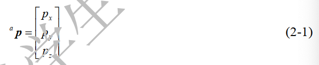

## 姿态
### 旋转变换矩阵表示法
需要处理 6 个约束方程条件下的 9 个参数求解问题。
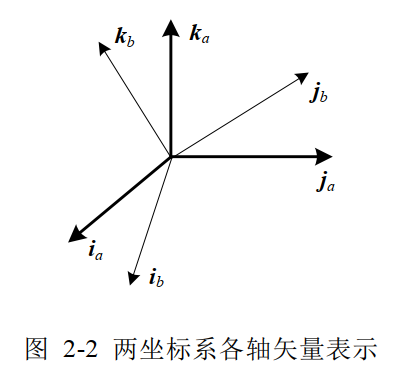
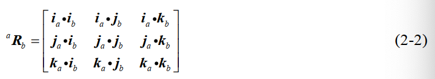

### 欧拉角表示法
绕 x 轴、绕 y 轴、绕 z 轴旋转 $\phi$ 角的基元旋转如下所示
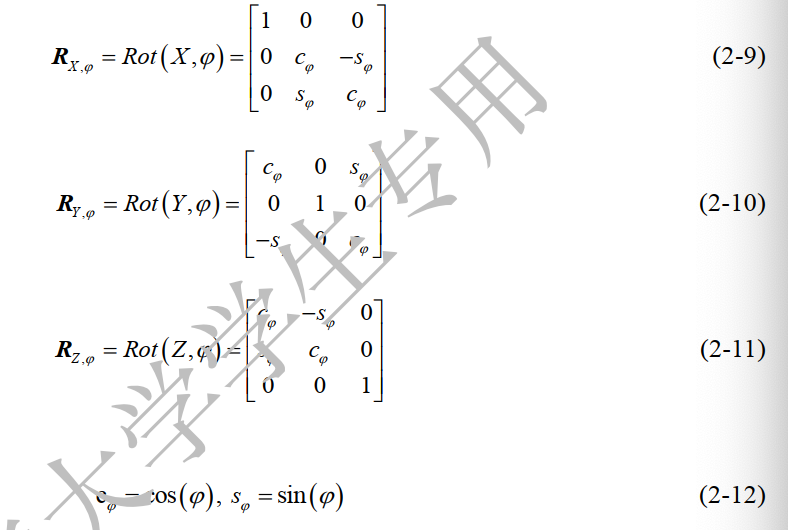

**右乘（内旋）**：每次旋转都是相对于“新坐标系”（即动坐标系旋转问题）的旋转。  
**左乘（外旋）**：每次旋转都相对于“原坐标系”（即固定坐标系旋转问题）的旋转。相应姿态称为 RPY。
任何外旋都等于角度相同但元素旋转顺序相反的内旋。在机器人运动学中，描述机器人关节的旋转时，内旋可以更自然地对应关节自身的转动；而外太空飞行器的姿态控制中，外旋可以方便地以太空固定坐标系为参考来描述飞行器的旋转。

### 欧拉轴-角表示法
转轴 + 围绕该转轴转动的角度

### 单位四元数表示法
四元数不会出现姿态表示的奇异；运算是一种线性运算，坐标系之间相对关系的计算效率通常比使用欧拉角或旋转矩阵的情况高；角位移、速度、加速度及动量等可表示成简单的形式；运算方程要简单得多。  
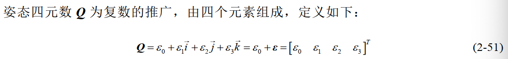
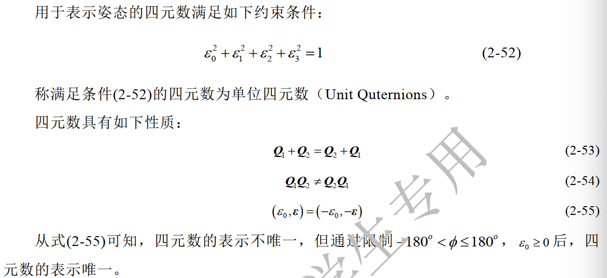
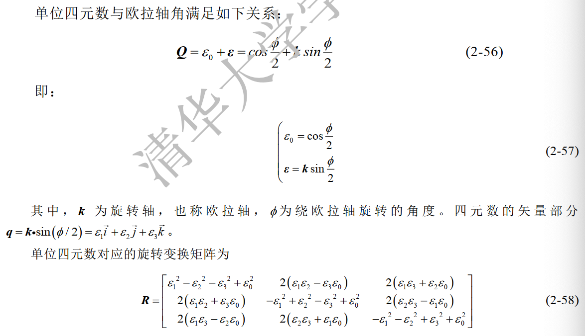

**为什么四元数没有万向锁问题？**
欧拉角通过三个角度来描述旋转，当第二次旋转角度达到正负 90° 时，第一次旋转轴和第三次旋转轴会重合，导致系统失去一个自由度，这就是万向锁现象。
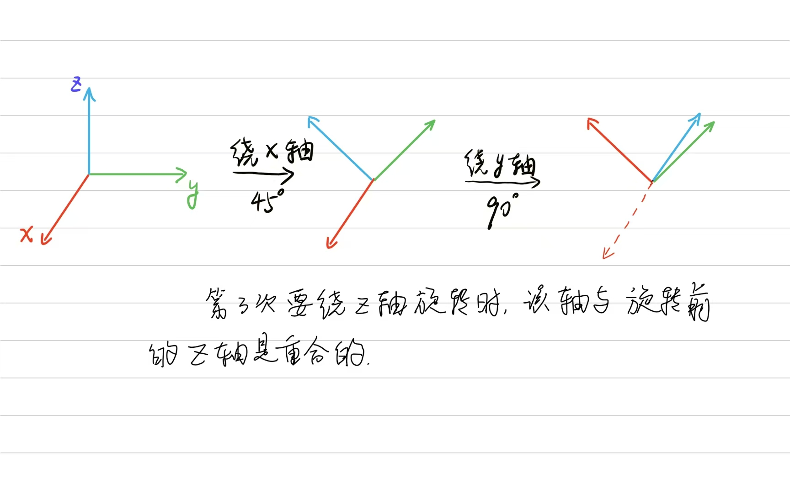
四元数没有欧拉角中的绕轴旋转的顺序问题，不存在旋转轴重合导致自由度丢失的情况。  
欧拉角进行插值时，角度的不连续性和万向锁问题，很难实现平滑插值。

## 刚体的运动
刚体的一般运动可表示为刚体质心的平动（线速度 $\bf{v}$）及绕质心 O 的转动（角速度$\bf{\omega}$）的合成
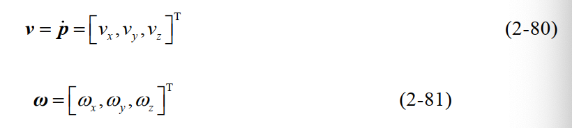

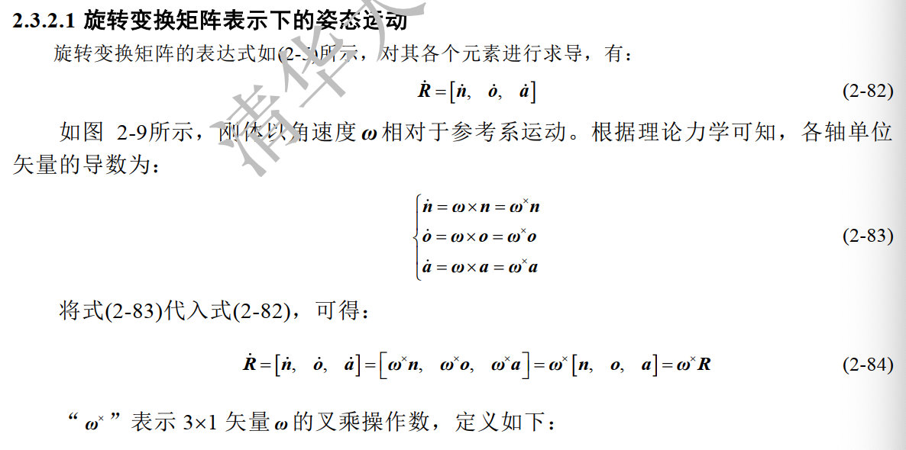

# 运动学
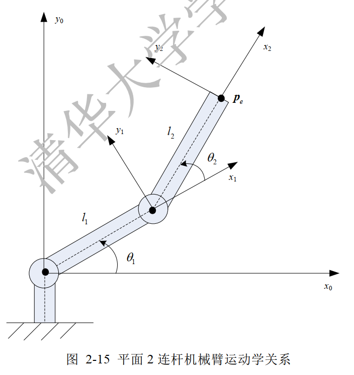
## 正运动学
**定义**：根据关节状态 $(\bf{q}, \dot{\bf{q}}, \ddot{\bf{q}})$，确定机械臂末端状态 $(\bf{X}_e, \dot{\bf{X}}_e, \ddot{\bf{X}}_e)$的问题称为运动学正问题，包括位置级、速度级和加速度级三个层次。  

### 位置级
$$\bf{X}_e = fkine(\bf{q})$$
以图 2-15 的平面 2 连杆为例，根据几何关系可得机械臂末端位置 $\bf{p}_e$ 与机械臂关节变量 $\bf{q}$ 的关系如下所示：  
$$ 
\begin{align}
&x_e = l_1c_1 + l_2c_{12} \\
&y_e = l_1s_1 + l_2s_{12} 
\end{align}
$$
其中，$c_{12} = cos(\theta_1 + \theta_2)$.
写成向量形式如下所示，为平面 2 连杆机械臂的位置级正运动学方程。
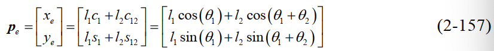

### 速度级
$$\dot{\bf{X}}_e = \bf{J}\dot{\bf{q}}$$
$\bf{J}$ 称为机械臂的雅可比矩阵，可以认为是机械臂关节速度到末端速度的传动比。
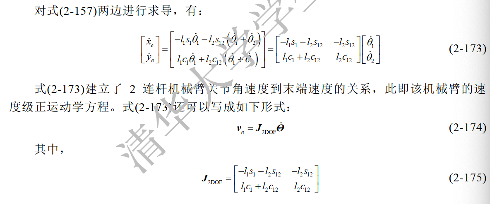
速度级正运动学方程也可写成如下的形式：  
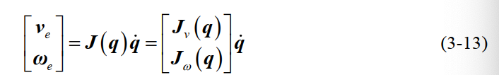
$\bf{J}_v$ 和 $\bf{J}_{\omega}$ 分别对应末端线速度和角速度部分。 
Jacobian 矩阵的计算方法有，利用各关节位姿齐次变换矩阵（DH坐标系，MDH）；根据末端位姿矩阵直接微分（末端位姿矩阵的表达式推导后，可直接进行求导）。  

### 加速度级
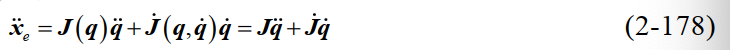

## 逆运动学
**定义**：根据机械臂末端状态 $(\bf{X}_e, \dot{\bf{X}}_e, \ddot{\bf{X}}_e)$，确定关节状态 $(\bf{q}, \dot{\bf{q}}, \ddot{\bf{q}})$ 的问题，称为运动学逆问题，也包括位置级、速度级和加速度级。 

### 位置级
$$\bf{q} = ikine(\bf{X}_e)$$
以平面 2 连杆为例，已知 $\bf{p}_e$，通过上方的正运行学方程求解 $\theta_1, \theta_2$.  
逆解存在无解或者多个解的情况。

### 速度级
$$\dot{\bf{q}} = \bf{J}^{-1}\dot{\bf{x}}_e$$  
当 $\bf{J}$ 是不可逆的时候，关节角速度将为无穷大，实际中是不可能存在的，此现象称为机械臂的运动学奇异，对应的关节臂型 $\bf{q}$ 称为奇异臂型，末端位姿称为奇异位姿。运动学奇异的本质是机械臂损失了一个或多个自由度。  

# 动力学
动力学比运动学复杂多了，上课的时候老师也没有在这方面做过多的讲解。。。简单描述之后就进入了空间机器人的建模和 simulink 的仿真实验了。这里就从书上摘取一些知识吧，实在是精力有限。   
## 欧拉方程
**动量矩**：考虑一个质量为 $m_i$ 的质点，它具有线动量 $\bf{p}$  
$$ \bf{p}_i = m_i \dot{\bf{R}}_i $$
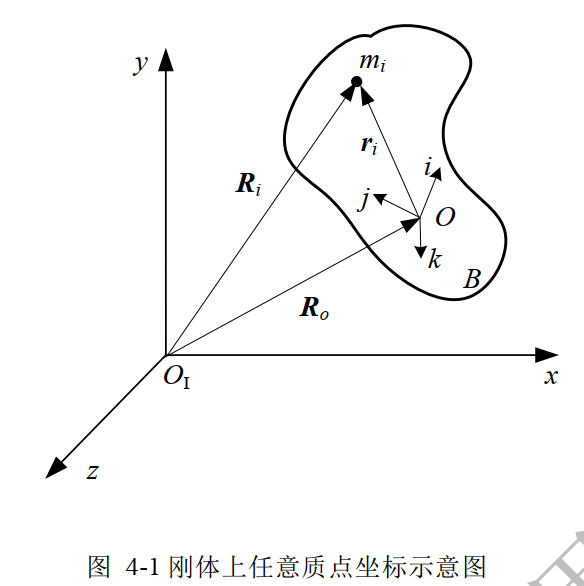
这个动量关于任一一点 O 的矩定义为  
$$ \bf{h}_i = \bf{r}_i \times m_i \dot{\bf{R}}_i $$  
根据 $\bf{R}_i, \bf{R}_O, \bf{r}_i$ 之间的关系，可得下方关系式： 
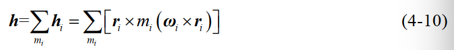
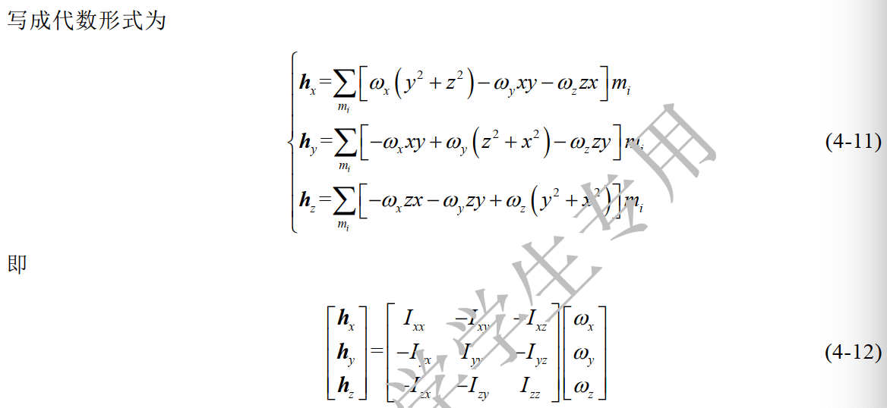
惯性矩 $I_{xx}, I_{yy}, I_{zz} $ 计算公式如下所示：  
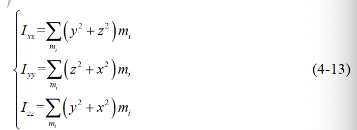
惯性积 $I_{xy}, I_{yx}, I_{xz}, I_{zx}, I_{yz}, I_{zy}$ 计算公式如下： 
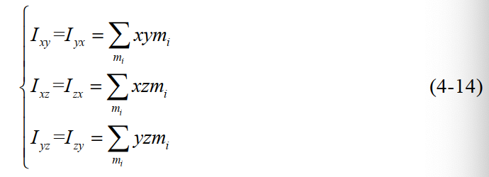
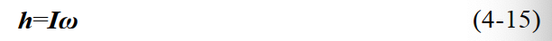
其中，$\bf{I}$ 为刚体相对于 O 的惯性张量。 
一个质心的转动惯量为 
$$
\bf{I} = mr^2
$$

**欧拉力矩方程**：当取刚体质心为参考点时，则角动量 $\bf{h}$ 随时间的导数等于作用在刚体质心的外力矩 $\bf{T}$， 即
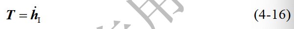
上边描述的是绝对运动，实际中的角动量相对于刚体本体系的微分，即对应相对运动，则有  
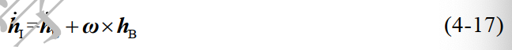
因此欧拉力矩方程为 
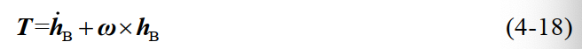

## 达朗贝尔原理
假设一质点在惯性基下的运动，作用于其上的主动力为 $\bf{F}$, 约束力为 $\bf{F}_N$，根据牛顿第二定律，质点的动力学方程为：
$$ m\ddot{\bf{r}} = \bf{F} + \bf{F}_N $$
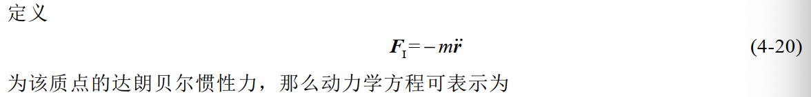
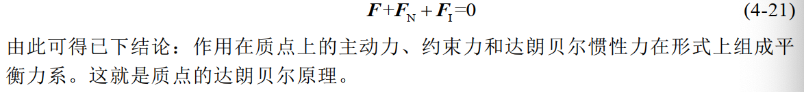

# 机械臂建模
是研究机械臂运动学、动力学等特性的基础。通常包含运动学建模和动力学建模两大部分。
运动学要解决的问题还是比较直观的，但是动力学就复杂很多。虽然我的方向是研究轨迹优化，但，一直停留在运动学层面，也从没有深入到运动控制和轨迹跟踪的领域。  
## 运动学建模
除了上边介绍的平面二连杆几何法，还有 DH 参数法。  
DH 参数法在运动学建模中的作用是建立坐标系，定义参数，推导齐次变换矩阵，解决运动学问题。
### 经典 D-H 表示法
规定 i-1 连杆的坐标系的轴 $z_{i-1}$ 与关节 i 的旋转轴平行。
经典法改进法没有本质区别，根据个人习惯选择。下边只介绍 MDH。  

### M D-H 表示法
规定 $z_{i}$ 与关节 i 的旋转轴平行。 
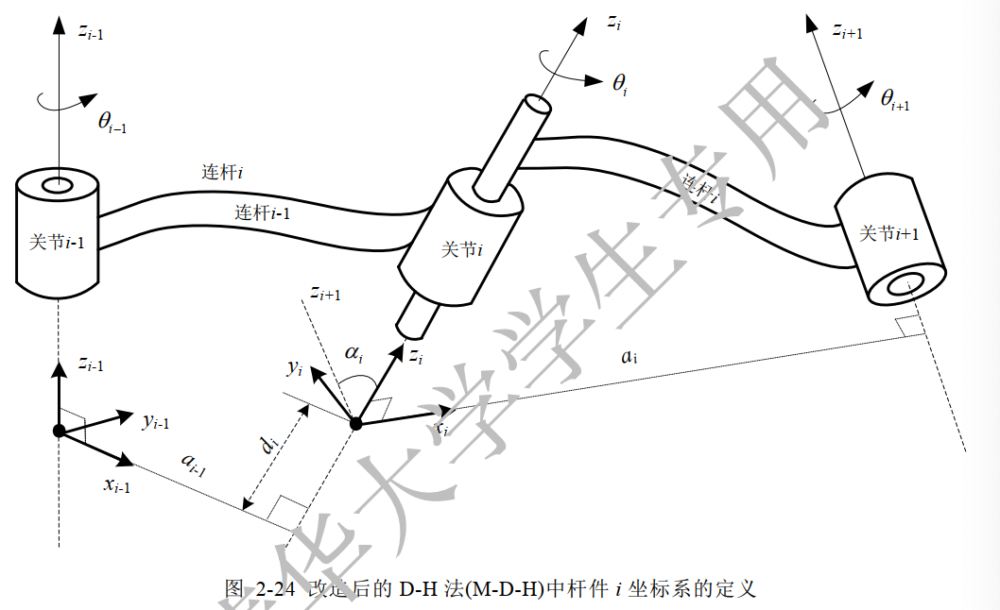
$\theta_i$：绕 $z_i$ 轴（右手规则）由 $x_{i-1}$ 转向 $x_i$轴的关节角。如下图所示的 $\theta_2$，x1 沿着 l1 轴，x2 沿着 l2 轴。
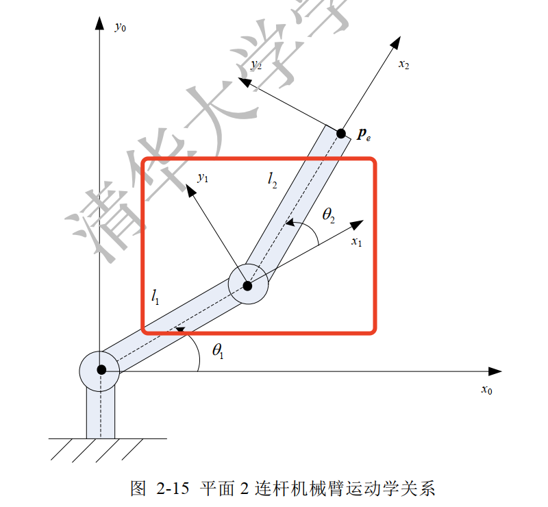
$d_i$： $x_{i-1}$ 轴和 $z_{i}$ 轴的交点到第 i 坐标系的原点到沿 $z_{i}$ 轴的距离。对于转动关节，关节偏移量是一个固定值。  
$a_i$：从第 i 坐标系的原点到 $x_{i}$ 轴和 $z_{i+1}$ 轴的交点的偏置距离，沿 $x_{i}$ 轴方向。连杆长度，通常是固定的。    
$\alpha_i$：绕 $x_{i}$ 轴，由 $z_{i}$ 轴转向 $z_{i+1}$ 轴的角度。表示相邻两个关节之间的扭转情况，对于特点的机器人结构，每个连杆的扭角是固定值。    

相邻连杆坐标系间的位姿关系为：
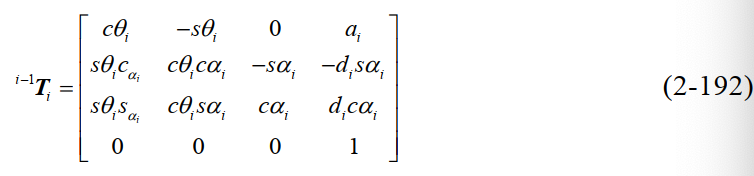
基于 D-H 的位置级正运动学方程为：
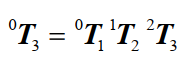

## 动力学建模
**动力学可解决的问题**：
1. 运动控制与轨迹跟踪：通过动力学模型，能够精确计算出为了实现特定的运动轨迹，各关节需要施加的力或力矩。有助于设计出更有效的控制算法，使机器人能够准确地跟踪期望的轨迹，提高运动的精度和稳定性。  
2. 负载能力评估：可以分析机器人在不同的姿态和运动状态下，各关节和连杆所承受的力和力矩，评估机器人的负载能力。  
3. 可以帮助分析不同运动规划和控制策略下的能量消耗，优化机器人的运动轨迹和控制算法，降低能量消耗，延迟机器人的工作时间。  
4. 碰撞检测与安全设计：动力学模型可以预测碰撞力的大小和方向，基于此，可以设计碰撞检测系统和安全机制，以保护机器人和周围环境的安全。  

### 拉格朗日法
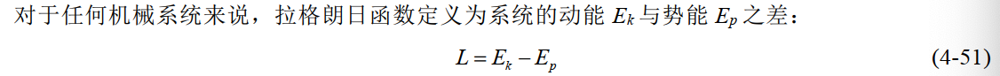
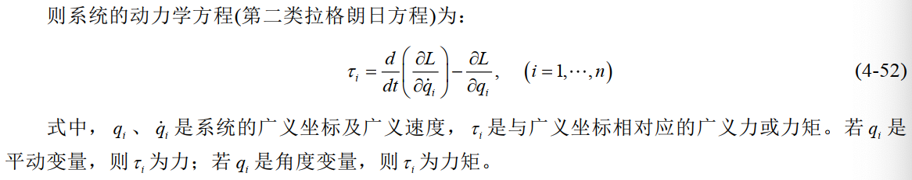

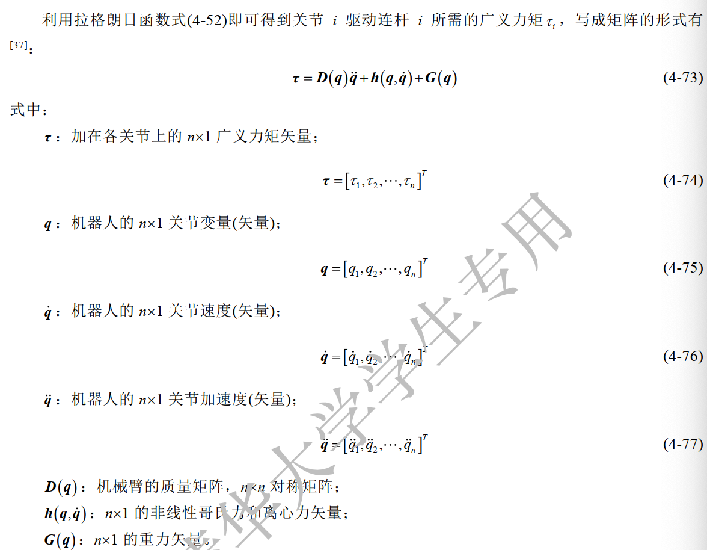

**疑问：**$\textcolor{blue}{其实，我没有理解为什么是动能减去势能之差，后边的求导又是什么意思，这求解出来的到底是什么}$
在理想情况下，根据守恒定律，动能和势能是可以相互转换的，但这似乎跟 L = Ek - Ep 也没有太大关系。拉格朗日方程，也没有具体的推导过程，可能是过于复杂了，只说是从能量角度描述系统运动规律。

#### 双连杆动力学方程手动推导
光是看书里的实例而不自己进行推导理解的话，其实相当于从书本 copy 知识而已，完全没有进入自己的大脑，有一种好像懂了，好像又没懂的感觉。  
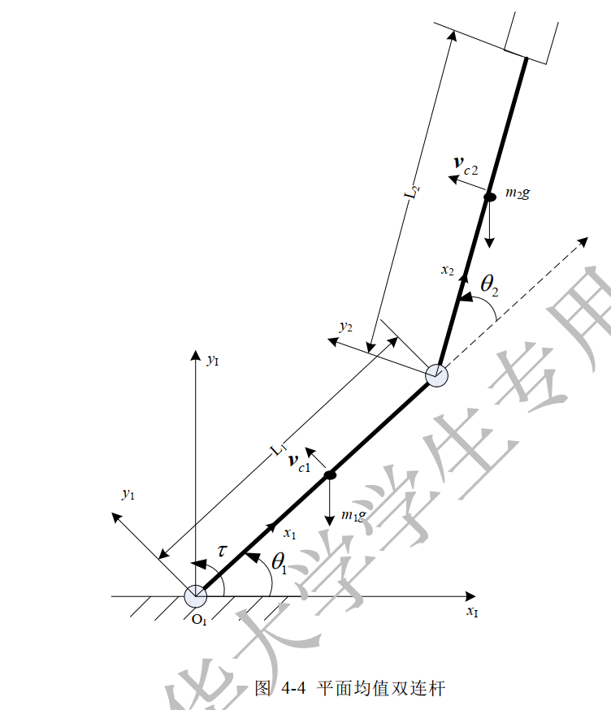

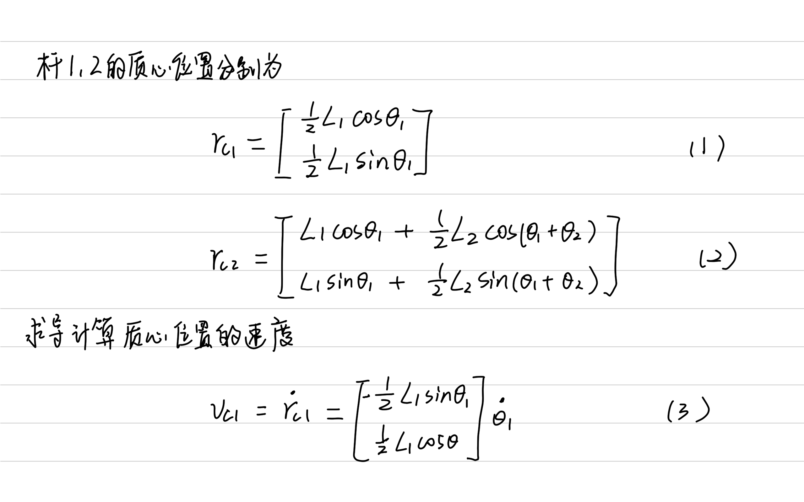
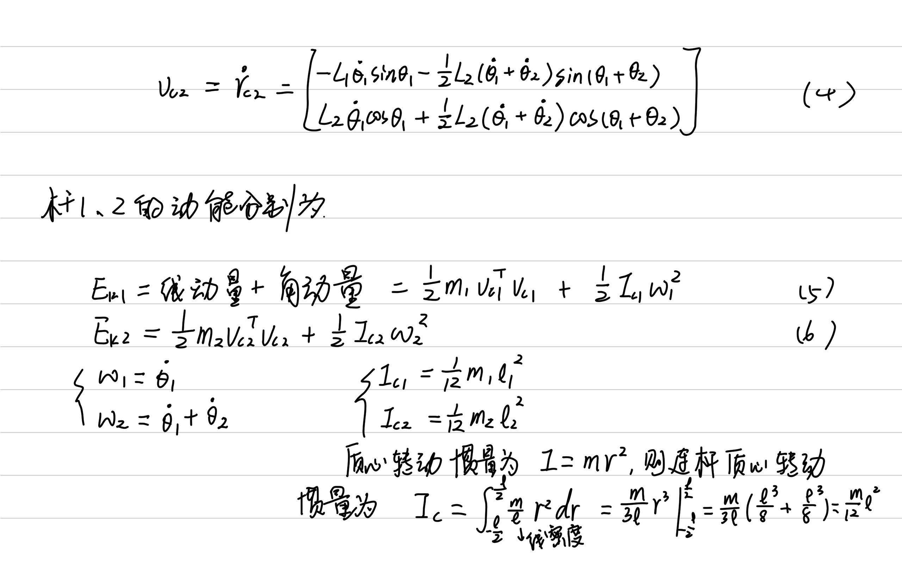
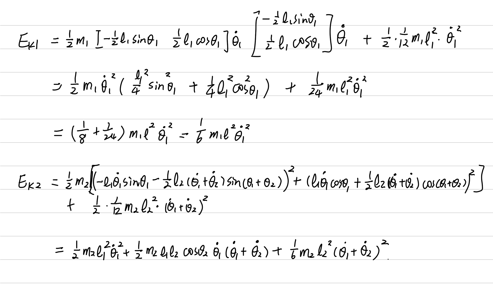
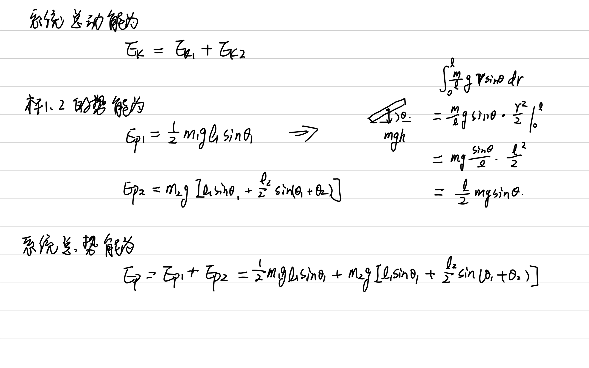
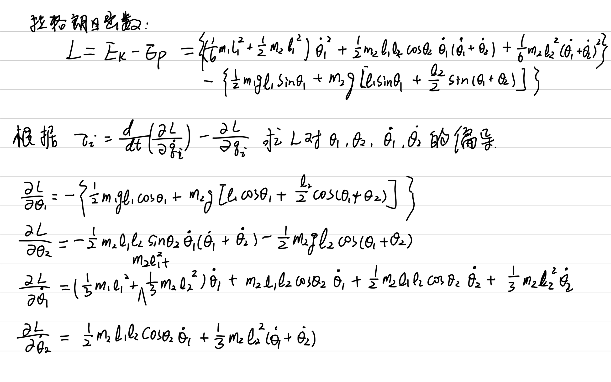
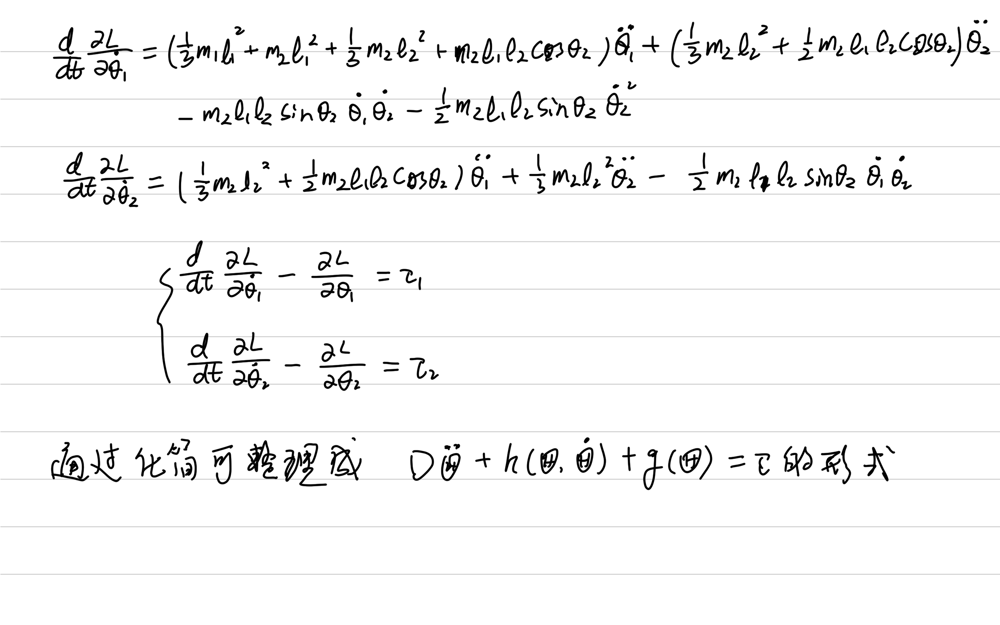

#### 特点
拉格朗日法利用齐次变换矩阵，计算效率太低。好处是对于机械臂这种关节空间坐标计算很方便，可以方便地得到每个连杆的运动方程。

### 牛顿-欧拉法
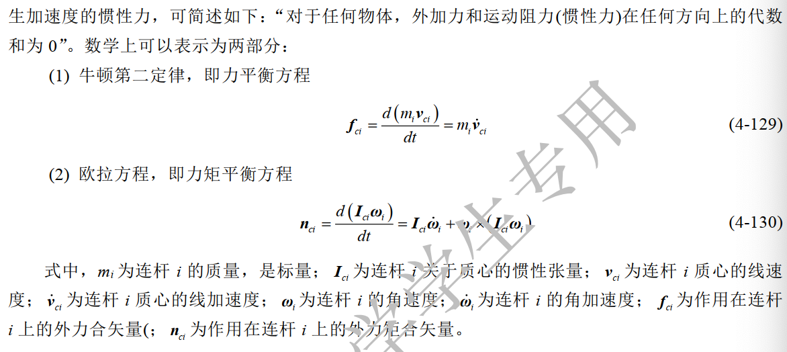
**力平衡方程：**
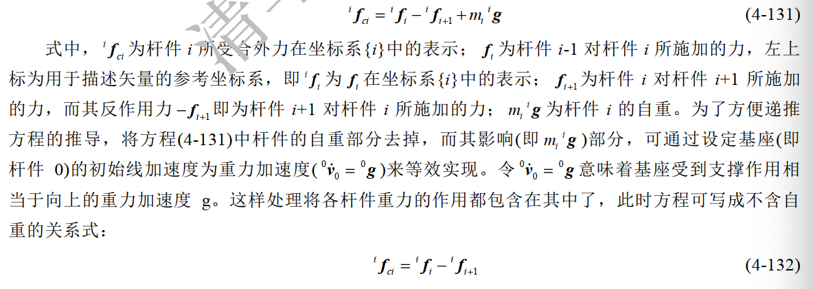
**力矩平衡方程**
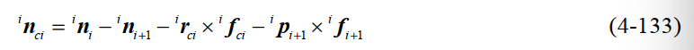
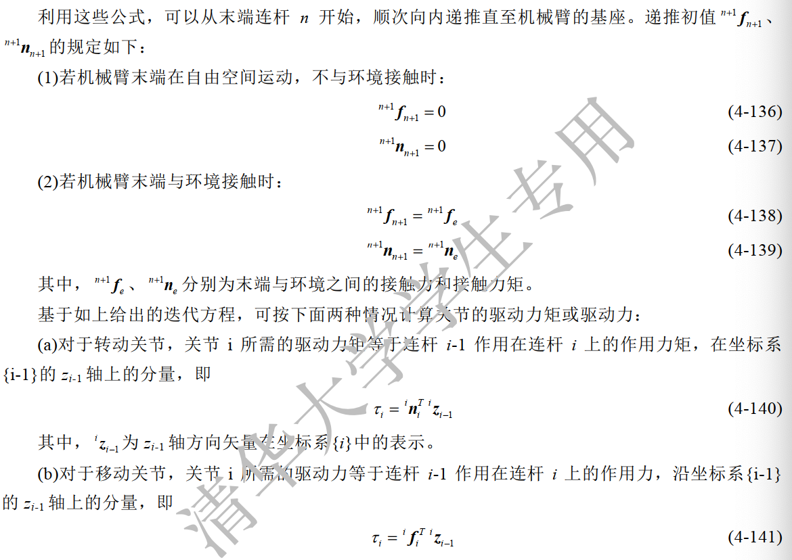

**递推的牛顿-欧拉动力学算法**
算法由两部分组成：
1. 首先从连杆 1 到连杆 n 递推计算各连杆的速度和加速度
2. 再由牛顿——欧拉公式计算出每个连杆的惯性力和力矩，从连杆 n 到连杆 1 递推计算各连杆内部相互作用的力和力矩，以及关节驱动力和力矩。

#### 双连杆动力学方程手动推导
书上没有利用 牛顿-欧拉法 的推导实例，之前上课讲的这部分也确实是忘得差不多了。就拿上边的例子试着推导一下吧。。。还得找一些以前的笔记看看。

$\textcolor{red}{待更新}$

## 空间机器人建模
之前上课做了空间飘浮二连杆机器人的建模和 simulink 仿真实验，过程资料都在文档和程序文件里，现在回顾一下以前做的东西，把建模，实验等内容记录在这里，方便将来有需要的时候能快速找到相关知识。
$\textcolor{red}{待更新}$