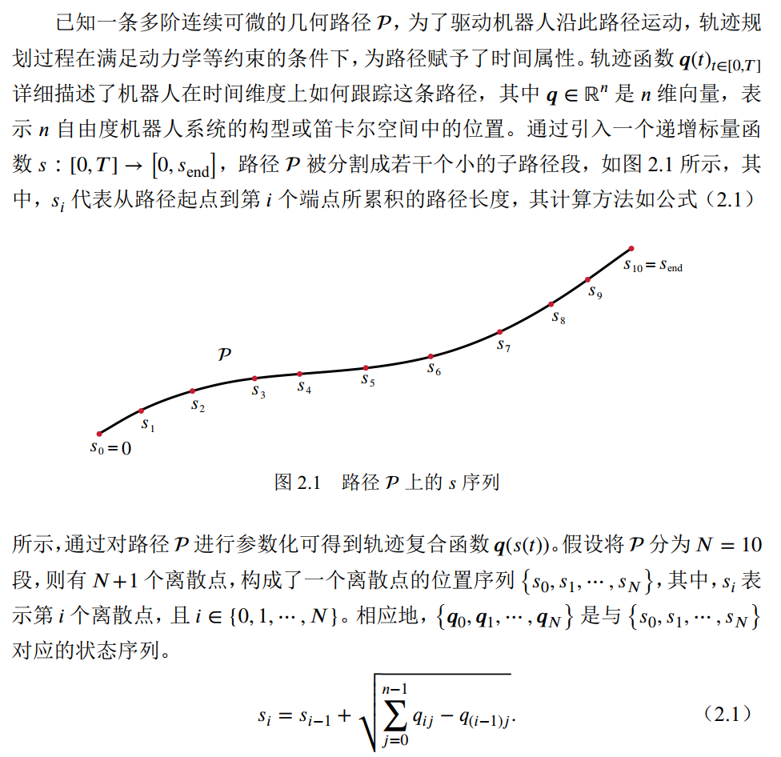
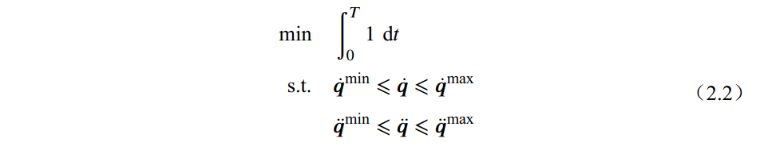
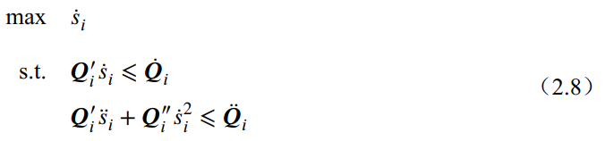
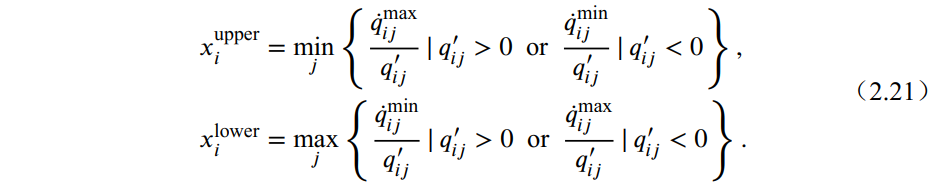
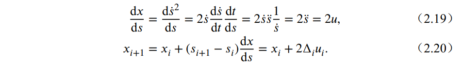
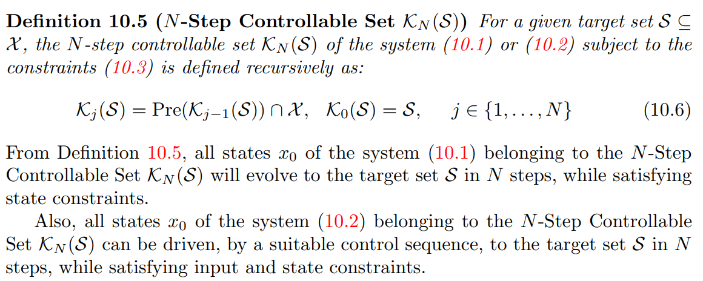
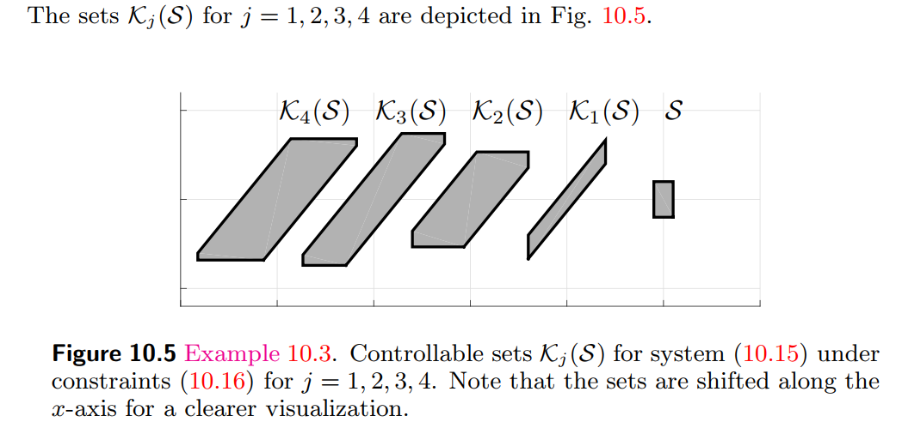

**参考文献:** H. Pham, Q.C. Pham, A new approach to time-optimal path parameterization
based on reachability analysis, IEEE Trans. Robot. 34 (3) (2018) 645–659.  

**注：** 为了减少编辑的时间，下边就用贴图的形式来展示公式了。

# 基本介绍
TOPPRA 是一种基于 MPC 中的可达性分析概念的时间最优轨迹规划算法，旨在高效解决二阶动力学约束下的时间最优规划问题。  
TOPP 是一种时间最优规划的路径参数化技术。常见的轨迹优化方法比如插值的方法，计算的时候需要应对的每个自由度的轨迹计算，但是路径参数化方法可以通过计算一个标量来求解所有自由度的轨迹。下边做个完整的介绍：  

最终优化的目标和参数都转换成和 s 相关的一阶导和二阶导上。  

# 动力学约束
在轨迹优化问题中引入动力学约束，如速度约束和加速度约束，约束范围分别用 $\left[\dot{\bf{q}}^{\mathrm{min}}, \dot{\bf{q}}^{\mathrm{max}} \right ]$和$\left[\ddot{\bf{q}}^{\mathrm{min}}, \ddot{\bf{q}}^{\mathrm{max}} \right ]$表示，为获得时间最短轨迹，优化问题可构造为 

通过链式求导法则，$\bf{q}(s(t))$ 对时间 $t$ 求一阶导数、二阶导数分别得到路径参数化后的速度、加速度轨迹函数如下所示
$$
\begin{align}
\dot{\bf{q}} &= \bf{q}' \dot{s} \\
\ddot{\bf{q}} &= \bf{q}' \ddot{s} + \bf{q}'' \dot{s}^2
\end{align}
$$
其中，$\bf{q}'$、$\bf{q}''$、$\bf{q}'''$ 表示 $\bf{q}$ 对 $s$ 的一阶导数、二阶导数。  
考虑速度、加速度时间最优问题通过路径参数化的技术将优化问题转换为迭代求解最大路径速度，优化问题转换成如下形式

其中，
$\bf{Q_i}'=\begin{bmatrix}  
 \bf{q}'_i & -\bf{q}'_i
\end{bmatrix}^\mathrm{T} $， 
$\bf{Q_i}''=\begin{bmatrix}  
 \bf{q}''_i & 
-\bf{q}''_i
\end{bmatrix}^\mathrm{T} $，  
$\dot{\bf{Q}}_i=\begin{bmatrix}  
 \dot{\bf{q}}_i^{\mathrm {max}} &
-\dot{\bf{q}}_i^{\mathrm {min}}
\end{bmatrix}^\mathrm{T} $，
$\ddot{\bf{Q}}_i=\begin{bmatrix}  
 \ddot{\bf{q}}_i^{\mathrm {max}} &
-\ddot{\bf{q}}_i^{\mathrm {min}}
\end{bmatrix}^\mathrm{T} $。

# 约束处理
## 一阶约束
速度约束还是比较好处理的，很容易就能表示出 $\dot{s}$ 的范围。那么 $x_i \in \mathcal{X}_i$，$\mathcal{X}_i = [x_i^{\rm{lower}}, x_i^{\rm{upper}}]$.

## 二阶约束
$\dot{s}$ 和 $\ddot{s}$ 存在着如下的关系

根据公式 2.20 ，把 $x = \dot{s}^2$ 当做是系统状态，$u = \ddot{s}$ 当做是外部的控制输入，那么这个公式就是一个简单的线性系统。
### MPC 可达性分析  
在 MPC 的可达性分析中，有一个概念称为控制集。其概念如下所示：  

在第 $N$ 步给定目标状态集 $\mathcal{S} \subseteq \mathcal{X}_N$，同时在状态约束 $\mathcal{X}$ 和控制约束 $\mathcal{U}$条件下，第 $j$ 步状态控制集 $\mathcal{K}_j(\mathcal{S})$ 递归地定义为
$$
\mathcal{K}_j(\mathcal{S})=Pre(\mathcal{K}_{j-1}(\mathcal{S}))\cap \mathcal{X}_{j}, \,\mathcal{K}_0(\mathcal{S})= \mathcal{S}, \, j \in \left \{1,\dots,N \right \},
$$
其中，$Pre(\mathcal{K}_{j-1}(\mathcal{S}))$ 表示一步后向可达集，即基于给定第 $N$ 步的目标 $\mathcal{S}$，如果 $x_{N-1} \in Pre(\mathcal{K}_{j-1}(\mathcal{S}))$，则一定存在一个控制输入 $u_j$ 驱动状态 $x_{N-1}$ 到 $x_{N} \in \mathcal{S}$。因此通过递归求解一系列的控制集可以得到第 0 阶段状态 $x_0$ 所在的集合。
这个概念确实不太好理解，通过下图做个简单的说明(其他概念的具体说明就放 MPC.md 那个文件里了)  
系统控制集 $\mathcal{K}_N(\mathcal{S})$ 在约束下的 $j=1,2,3,4$ 的控制集

其中，控制集中的 $j$ 与路径离散化中的 $i$ 是相反的顺序，也就是，从时间顺序来说，$\mathcal{K}_4(\mathcal{S})$发生的时间早，而 $\mathcal{S}$是最后一个时刻的状态集合。已知 $\mathcal{S}$，一定存在控制输入 $u_1$ 使得$\mathcal{K}_1(\mathcal{S})$ 内的任意一状态映射到 $\mathcal{S}$ 内的任意一状态。同理，一定存在控制输入 $u_2$ 使得 $\mathcal{K}_2(\mathcal{S})$ 内的任意一状态映射到 $\mathcal{K}_1(\mathcal{S})$ 内的任意一状态，以此类推到其他的控制集。

### 可达性分析在 TOPPRA 中的应用
#### 问题描述
举个例子，路径规划算法比如说 RRT* 已经规划出来从起始点到终点的离散点序列，然后通过插值能得到没有速度信息的光滑轨迹。通过路径参数化再将该轨迹离散成颗粒度更小的离散序列，对应着序列$\{ s_0, s_1, ..., s_N\}$。假设开始运动时的速度是0，运动结束时的速度也是 0，则
$$\dot{\bf{q}} = \bf{q}' \dot{s} = 0$$ 
那么 $x_0 = \dot{s}_0^2 = 0$ 且 $x_{end} = 0$。那么 MPC 可达性分析中所说的 $\mathcal{S}$ 就是 $x_{min} = 0, x_{max} = 0$ 了。（这里的 $\mathcal{S}$ 只有一个维度）。  
设第 $N$ 步对应的期望状态为 $\mathcal{K}_N = \mathcal{S} = [0, 0] $，那么从公式 2.20 可以表示为。$\mathcal{K}_{N}$ 的最大值和最小值已知，那么需要求解 $x_{N-1}$ 的状态集合，即 $\mathcal{K}_{N-1}$    
$$
x_{N-1} + 2 \Delta_{N-1} u_{N-1} \in \mathcal{K}_{N}
$$

求解 $\mathcal{K}_{N-1}$ 可以通过构造以下优化公式，求下界用 min，求上界用 max，约束都是一样的。以 min 为例，第一个约束即使速度约束，第二个约束是控制集概念中的约束，第三个约束是加速度约束。
$$
\begin{align}
\min_{} \quad & x_{N-1} \\
\rm{s.t.} \quad
& x_{N-1}\in \mathcal{X}_{N-1} \\  
& x_{N-1}+ 2\Delta_{N-1} u_{N-1} \in \mathcal{K}_{N} \\
& {\bf{q}}'_{N-1} u_{N-1} + {\bf{q}''}_{N-1} x_{N-1} \in [\ddot{\bf{q}}_{N-1}^{\rm{min}}, \ddot{\bf{q}}_{N-1}^{\rm{max}}].
\end{align}
$$
#### 线性规划求解可控集
在论文中提到了一种 LP（线性规划）的方法，其实之前一直都没太看懂。不过再难啃的骨头也应该尝试得啃下来。。。  $\textcolor{red}{下次再更新这部分吧}$

#### 时间最优轨迹优化
显然，通过上边的方式可以从 $\mathcal{K}_{N-1}, \mathcal{K}_{N-2}, ...,  \mathcal{K}_{1}$ 逐步求解每一步的控制集。
那么，时间最优的轨迹优化问题就可以表示为求解 $u$ 最大
$$
\begin{align}
\max_{} \quad & u_{i} \\
\rm{s.t.} \quad
& x_{i}\in \mathcal{X}_{i} \\  
& x_{i}+ 2\Delta_{i} u_{i} \in \mathcal{K}_{i+1} 
\end{align}
$$
显然这个优化问题同样可以通过上边的 LP 方法进行求解。

TOPPRA 算法的核心思想就是如何去处理二阶约束，通过 MPC 的控制集概念，能够很快地求解出每一步的控制集，只要控制集确定了，就一定存在至少一个输入 $u$ 使得系统从当前状态到下一个状态属于该控制集。