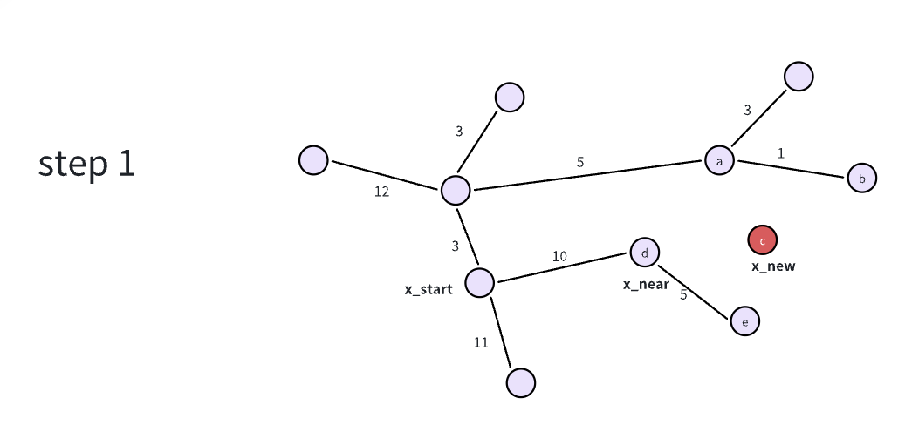
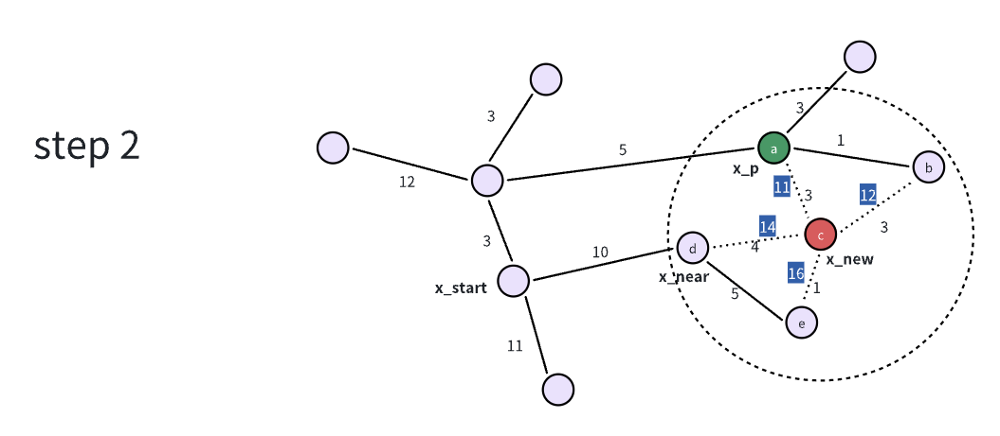
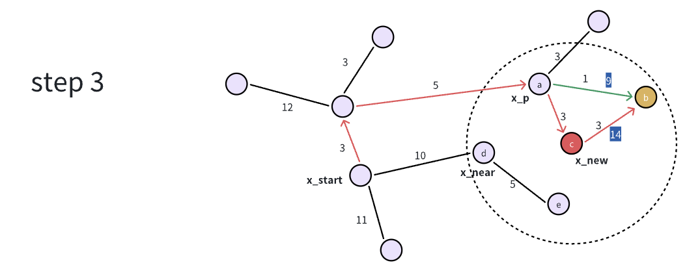
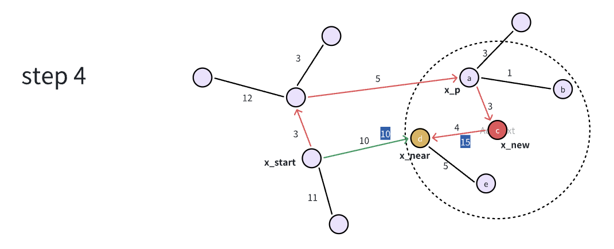
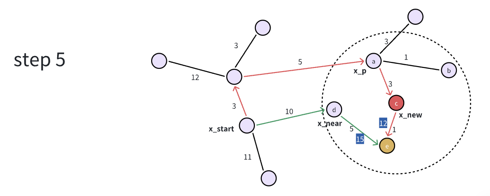
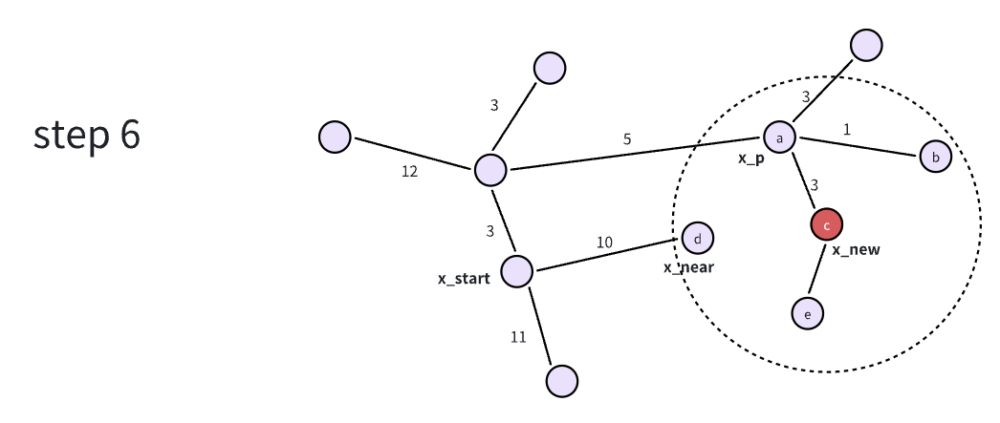

# 算法流程
1. 以起始点作为根节点建立一个棵搜索树 
2. 在空间中随机采样一个无碰撞的状态点 r 
3. 计算状态点 r 与树中最近的节点 near 
4. near 到 r 方向上，从 near 开始前进一个步长得到新的状态点 new 
5. 做碰撞检测：1）new 是否发生碰撞 2）从 near 到 new 连线中是否发生碰撞检测 
6. 发生碰撞，回到第 2 步重复 
7. 不发生碰撞，查找 new 一定半径范围内树上的 neighbors 节点，选择其中一个从根节点到 neighbor再到 new 代价最小的节点为 new 的父节点 
8. rewiring：在 new 的 neighbors 节点中计算，是否先经过 new 再经过 neighbor 能获得更小的代价，若是，把 new 作为 neighbor的父节点， 

# 思考
1. 第 7 步和第 8 步都是从 new 的候选 parents 里预连接去计算总代价。说真的，这两个的顺序好像有点问题吧。要是第 7 步找好了最优的 parent，
    第八步就应该只是决定是否要调换 new 和 parent。再从候选 parents 遍历一遍不就乱了么？  
    解答：事实上，只要理解了谁是父节点，谁是子节点以及父子节点 1 对多的关系，就能得出 7 和 8 步骤没问题的结论。  

2. 相比于 RRT，第 7 步和第 8 步是比较难理解的，刚学的时候有点绕不过弯。下边举个例子好好理解理解。自己创造个例子确实有点难度了，上网找了个例子，不过自己重头画了一下，然后把步骤也都细化了一下。

    **计算 x_new 和 x_near**

    

    **找到 r 半径范围内的 neighbors，然后选取从 x_start 开始到 x_new 代价最小的 neighbor 为父节点，即 a 点**

    

    **遍历 neighbors，计算 x_new 为父节点是否会得到全局代价更小的结果**  

    **b 点先经过 x_new 的话，代价为 11，而原始的代价为 9，代价没有更小，所以不修改 b 点的父节点**  

    

    

    **d 点先经过 x_new 的话，代价为 11，而原始的代价为 10，代价没有更小，所以不修改 d 点的父节点**

    

    **e 点先经过 x_new 的话，代价为 11，而原始的代价为 15，代价变更小，所以修改 e 点的父节点为 x_new**

    

    

3. 对我来说，一开始感觉代码里最不好实现的是找最近点，总想着是不是可以用 KDTree，在聚类的时候用过 KDTree 的包，但是输入的是 pcl::PointCloud,
    不确定是不是还接受其他的数据类型。。。但无论如何还是得遍历一遍树的节点的。  

4. 这是整理的第一个算法，所以耗时确实长了一些，感觉其他的基于采样的算法应该能快一些。  

5. 步长、r 近邻的 r，最大迭代数，这些变量的值都有什么讲究呢？  

    **步长**

    &nbsp;&nbsp;**小型环境 （< 10m）**：0.5 ~ 2.0米

    &nbsp;&nbsp;**中等规模（10m - 100m）**：2.0 ~ 5.0米

    &nbsp;&nbsp;**大型规模（> 100m）**：5.0 ~ 10.0米

    **r-近邻范围**

    &nbsp;**理论公式**

    $$ r = \gamma(\frac{\log{(n)}}{n})^{\frac{1}{d}}$$

    &nbsp;&nbsp;&nbsp;&nbsp;$\gamma$ 是一个调节参数，通常取 1.0 ~ 2.5  

    &nbsp;&nbsp;&nbsp;&nbsp;$n$ 是当前树中已有的节点数  

    &nbsp;&nbsp;&nbsp;&nbsp;$d$ 是搜索空间的维度  

    $\textcolor{red}{这个理论公式可以好好理解一下}$

    常见的经验值是 2D 平面 $r \approx $ 1.5 * step_size; 3D 空间  $r \approx $ 2.5 * step_size。

    **最大迭代次数**

    较小值 < 1000，适用于简单地图  

    较大值 > 5000，适用于复杂环境  

    迭代路径可以动态调整，或者设定一个收敛标准。

6. 如果是机械臂规划呢？

    代码里的 RRT Start 的节点是 3D 坐标信息为状态，如果是机械臂的话，可以创建一个 robotState，动态存储多个自由度关节角度信息。当然了，对于机械臂来说，碰撞检测是比较有难度的，且耗时的。后边也会参考 move!it 进行扩展，使这个算法既能用于 3D 空间，又能用于构型空间。

# 算法对比
